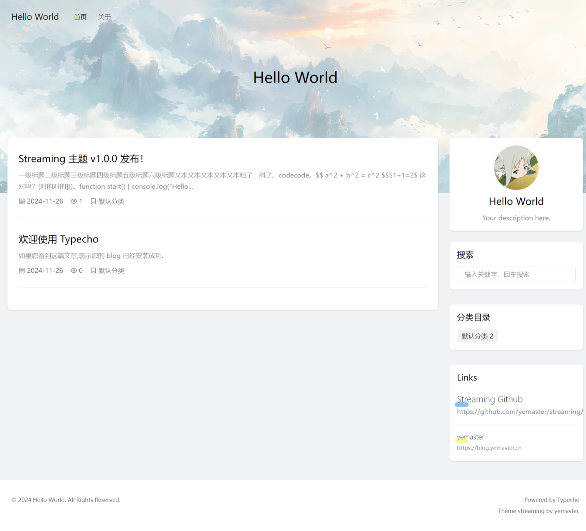
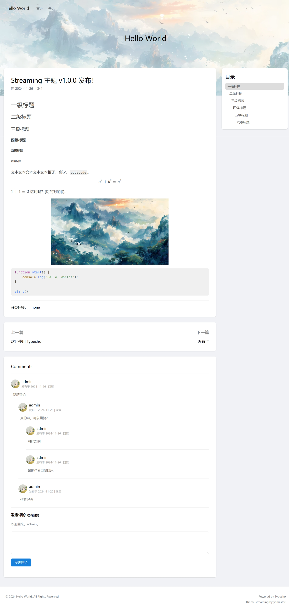
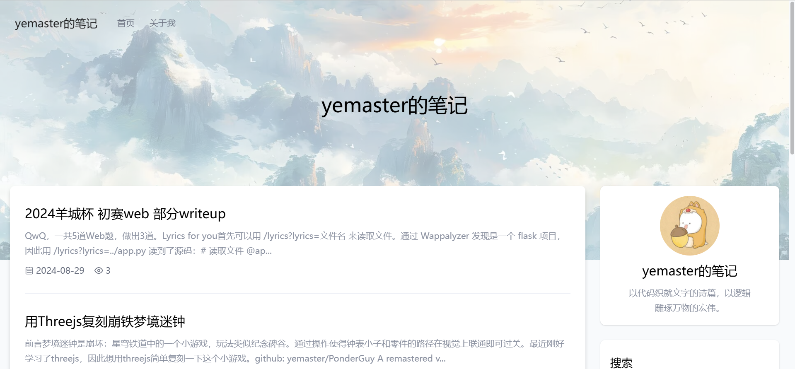

# Streaming

Streaming - 简约、轻量、美观的 Typecho 主题

Live Demo: [https://blog.yemaster.cn](https://blog.yemaster.cn)

  

## 特性

- 双栏排版，简约清爽。
- 个性化内容丰富，支持自定义背景，支持自定义头像，支持侧边栏自定义内容，支持自定义友情链接。
- 支持底部备案号和公网备案展示。
- 使用 Highlight.js 进行代码高亮。
- 使用 KaTeX 渲染公式。
- 文章自动生成目录。
- 部分静态资源还使用 jsdelivr，将来会支持配置自定义 cdn 链接。

## 安装

在 [Release](https://github.com/yemaster/streaming/releases) 页面下载 `.zip` 文件，上传并解压到 Typecho 的 `/usr/themes` 文件夹下，启用即可。

## 屏幕截图

## 更新日志

## TODO List

- 文章字体的自定义
- 夜间模式
- 文章目录加载过渡动画，空目录提示
- 代码高亮主题开启关闭，公式的开启关闭，代码高亮主题自定义
- 外部资源 cdn 链接自定义
- 优化文章页面排版